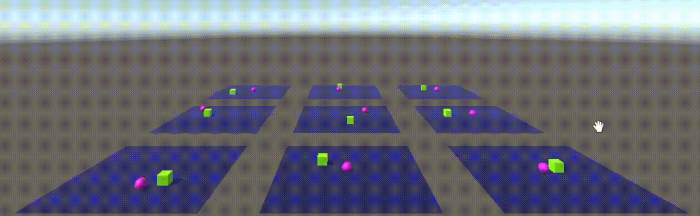

# 🏐 Multi-Environment Ball Agent RL Training (Unity ML-Agents)

This project demonstrates **Reinforcement Learning (RL)** in Unity using the **ML-Agents Toolkit**, where multiple Ball Agents are trained in parallel environments to efficiently learn the task of reaching a target.

---

## 🎥 Demo

Here’s a sample run of training with multiple environments:

*(The above GIF shows parallel environments where each pink ball agent learns to move toward its green target.)*

---

## 🚀 Project Overview

- **Environment:** Unity 3D + ML-Agents  
- **Agents:** Pink spheres (ball agents)  
- **Targets:** Green cubes placed randomly in the arena  
- **Training Setup:** Multiple environments running in parallel to accelerate training  
- **Reward Function:**  
  - ✅ Positive reward when agent reaches target  
  - ❌ Negative reward when agent falls off platform or misses target  
- **Algorithm:** PPO (Proximal Policy Optimization)  

---
